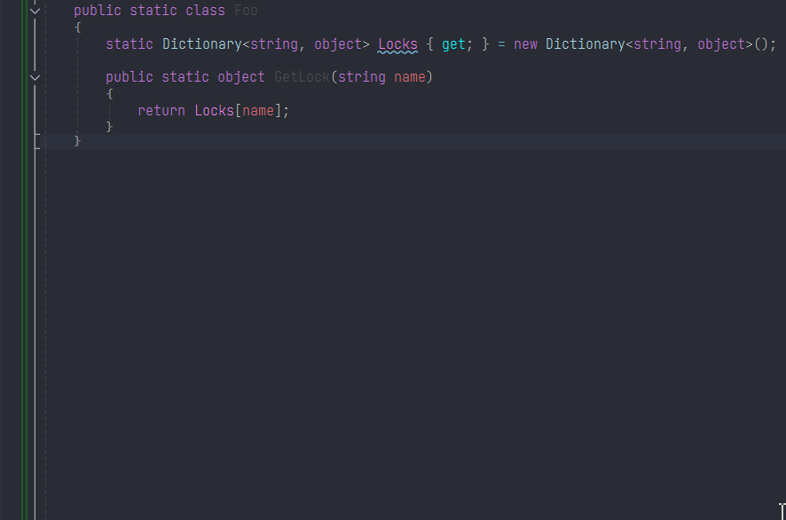

# Resharper.QuickActions

Quick context actions for Resharper that are accessible via the 'Quick actions' bulb:
 * Clone type - clones the focused class. The cursor must be either on the class Name or its body (empty space).
 * Clone method - clones the focused method. The cursor must be either on the method Name or its body (empty space).
 * Clone property - clones the focused property. Place cursor on any part of the target property definition.
